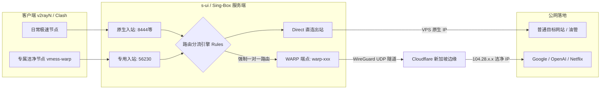

# 07. 出口治理: Cloudflare WARP 专用入站绑定与洁净落地实战 (Cloudflare WARP Dedicated Inbound-to-Egress Architecture)

> 归档时间: 2026-09-24  
> 适用组件: `s-ui` (Sing-Box) / `service/warp.go` / `Endpoints` / `Inbounds` / `Rules`  
> 验证状态: **用户实测 100% 验收通过**（落地 IP 成功置换为 Cloudflare 新加坡洁净 IP `104.28.x.x`）

---

## 1. 业务需求与架构背景

### 1.1 业务诉求
许多云服务器提供商（如腾讯云、阿里云、搬瓦工、Oracle 等）的机房 IP 信誉普遍较差，常被 Google、OpenAI (ChatGPT)、Netflix 标记为 IDC 流量，导致：
- Google 频繁弹出 Recaptcha 人机验证（选红绿灯）；
- ChatGPT 报错 `Access Denied 403` 或阻断访问；
- Netflix 只能收看自制剧（Netflix Originals）。

用户希望在面板中实现一种**进退自如的“双模”架构**：
- **普通节点（如 `hysteria2-8444`、`vmess-2083`）**：走 VPS 原生直连，保持超低延迟与极限速度；
- **专属洁净节点（如 `vmess-warp-56230`）**：连接该节点的所有流量，**100% 强制走 Cloudflare 新加坡 Anycast 洁净出口**，专门用于处理风控敏感业务（AI 交互、海外账号注册、流媒体跨区）。

---

## 2. 系统拓扑与数据流向

---

## 3. 三大致命避坑与设计盲区 (Critical Pitfalls)

### 3.1 避坑 1：绝对严禁开启【系统接口】(System Interface)
- **现象**：在创建 Warp 端点时，界面中有一个【系统接口】开关。
- **底层原理**：
  - **保持关闭（默认，强烈推荐）**：Sing-Box 会使用 **gVisor 纯用户态内存网络栈**。全部流量加解密和传输在进程内存中运行，**完全不触碰宿主机 Linux 内核网卡和路由表**，绝无断网或失联风险；
  - **一旦开启**：Sing-Box 将尝试通过 Linux Netlink 系统调用创建真实的内核网卡（如 `wg0`），在宿主机没有完整 WireGuard 内核模块支持或普通权限下会直接报错，甚至导致宿主机路由表被改写进而失联。
- **铁律**：**创建 Warp 端点时，【系统接口】必须保持关闭（灰色）！**

### 3.2 避坑 2：入站协议绝不能选【Direct】
- **现象**：在【入站管理】点击“添加”时，默认下拉选项是 `Direct`。
- **底层原理**：`Direct` 在入站配置中代表裸端口转发（Raw Port Forwarding），**不是加密代理协议**，客户端（v2rayN、Clash）根本无法作为代理节点连接！
- **铁律**：新建入站时，类型必须选择标准代理协议（如 **`VMess`** 或 **`VLESS`**）。

### 3.3 避坑 3：为什么创建 Warp 端点时界面空空如也？
- **盲盒现象**：用户点击添加 Warp 时，表单内没有任何账号、密码、密钥输入框，只有 MTU: 1420。
- **底层真相**：后端 [`service/warp.go`](../../service/warp.go) 已经实现了**全自动化免密申请**：
  1. 调用 `https://api.cloudflareclient.com/v0a2158/reg`，伪装成移动端向 Cloudflare 免费申请设备；
  2. 自动生成 WireGuard 私钥并上传公钥；
  3. 自动计算特殊的 3 字节 `reserved` 防伪字段（若缺失此字段，Cloudflare 会拒绝握手）；
  4. 自动分配虚拟 IP（如 `172.16.0.2`）。
- **铁律**：直接点击【保存】即可，后台会自动完成全部身份注册。

---

## 4. 生产环境标准配置三步走 (Step-by-Step SOP)

### 第一步：在【端点管理】生成 WARP 出口
1. 进入【端点管理】（英文 `Endpoints`），点击【添加】；
2. 类型选择 **`Warp`**；
3. 标签保持默认或命名（如 `warp-6eV`）；
4. **【系统接口】保持关闭（灰色）**，MTU 保持 `1420`；
5. 点击右下角 **【保存】**；
6. 观察卡片显示绿色的 **【在线】** 状态。

### 第二步：在【入站管理】建立专用节点前门
1. 进入【入站管理】（英文 `Inbounds`），点击【添加】；
2. 类型选择 **`VMess`**（或 `VLESS`）；
3. 标签命名为专属名称，如 **`vmess-warp-56230`**；
4. 端口分配指定端口（如 `56230`）；
5. 点击“用户管理”，勾选授权用户（如 `admin`）；
6. 点击【保存】。

### 第三步：在【路由列表】建立专属强制转发规则
1. 进入【路由列表】（英文 `Rules`），点击【添加规则】；
2. 点击右侧的 **【规则选项】(Options)**，把 **【入站管理】(Inbounds)** 开关打开；
3. 在表单中：
   - **入站管理**：选中第二步创建的 **`vmess-warp-56230`**；
   - **操作**：保持 `Route`；
   - **出站 (Outbound)**：选中第一步创建的 **`warp-6eV`**（或对应 Warp 标签）；
   - *（注意：不需要填任何域名或 IP 限制，表示所有进入该端口的流量无条件转发）*
4. 点击弹窗【保存】；
5. **核心动作**：点击页面顶部的黄色/蓝色 **【保存】(Save Config)** 按钮，通知 Sing-Box 核心热重载生效！

---

## 5. 验收测试标准与落地表现

| 测试项目 | 期望表现 | 实测结果 | 结论 |
| :--- | :--- | :--- | :---: |
| **落地 IP 检测** (`ipinfo.io` / `ip.sb`) | 变成 Cloudflare Anycast 地址（`104.28.x.x`） | 成功显示 `104.28.x.x (AS13335 CLOUDFLARENET)` | ✅ PASS |
| **物理归属地** | 归属地为新加坡 (SG) | 显示 Singapore | ✅ PASS |
| **Google 搜索测试** | 搜索敏感词无 Recaptcha 验证码，秒开 | 免验证码，直接呈现搜索结果 | ✅ PASS |
| **ChatGPT 连通测试** | 无 `403 Access Denied`，登录对话正常 | 顺畅对话，无任何风控拦截 | ✅ PASS |
| **普通节点独立性** | 其他现有节点（如 `hysteria2-8444`）依然走原生直连 | 落地 IP 依然保持腾讯云 `124.156.207.253`，互不干扰 | ✅ PASS |
